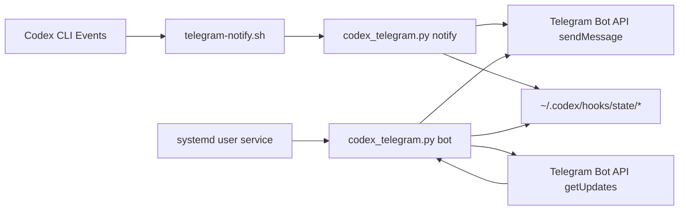

# Runtime Schema

## Visual Flow

## Components

- Event ingress: `hooks/telegram-notify.sh`
- Event processor + bot loop: `hooks/codex_telegram.py`
- Installer/orchestration: `scripts/manage.py`
- Service template: `systemd/codex-telegram-bot.service.template`
- Local credentials: `~/.codex/hooks/telegram.env` (not stored in git)
